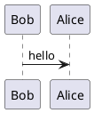
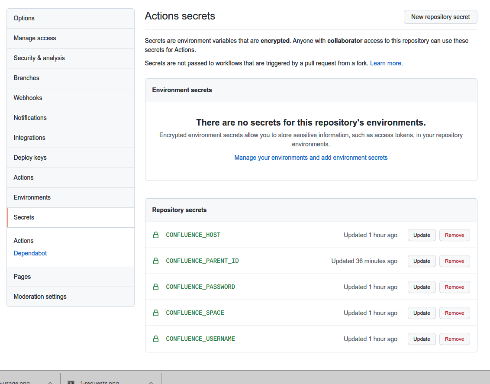

# This is test for Markdown To Confluence

## h2

### h3

#### h4

##### h5

- list:a
- list:b

1. ordered list: 1
2. ordered list: 2

[this is a link](#)

```bash
# this is bash code
echo hello confluence
```

Test plantuml remote link png:


Test uml support:




